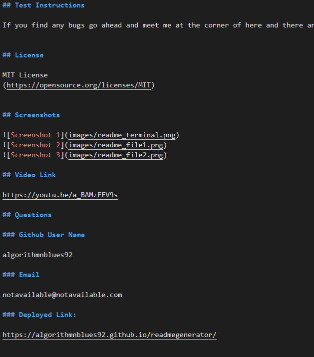

# Read Me Generator

## Table of Contents

1.[Description](#Description) 
2.[Installation Instructions](#Installation-Instructions) 
3.[Usage Information](#Usage-Information) 
4.[Contribution Guidelines](#Contribution-Guidelines) 
5.[Test Instructions](#Test-Instructions) 
6.[License](#License) 
7.[Screenshots](#Screenshots) 
8.[Questions](#Questions) 
    &nbsp 1a.[GitHub User Name](#Github-User-Name) 
    &nbsp 2a.[Email](#Email) 
    &nbsp 3a.[Deployed Link](#Deployed-Link) 

## Description 

This is a template for creating a read me generator for your git hub project, it has inputs and multiple choice and the ability to add screenshots as well as license badges. User will be asked for the title of their project, description of project, installation information, usage information, contribution guidelines, license, up to three screenshots, github user name, email and deployed website link.

## Installation Instructions

User will be required to have node.js and package inquirer@8.2.4 installed into your project.

## Usage Information

For those who would like an easy way to generate a readme for their project, create then move to folder of your choice.

## Contribution Guidelines

This is a solo mission.

## Test Instructions

If you find any bugs go ahead and meet me at the corner of here and there and send smoke signals after rubbing two Hurricane tall cans together and I will appear from a portal.

## License

MIT License
(https://opensource.org/licenses/MIT)

## Screenshots

## Questions

### Github User Name

algorithmnblues92

### Email

notavailable@notavailable.com

### Deployed Link:

https://algorithmnblues92.github.io/readmegenerator/

 